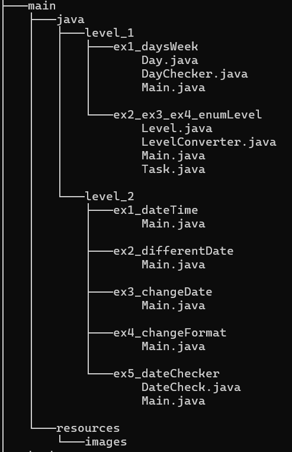

# Enum, Data, Record

Este proyecto está centrado en tres temas fundamentales de Java: enums, fechas y horas, y records.

## Tecnologías

* Java 21
* IntelliJ IDEA
* GitHub

## Estructura del proyecto

### Nivel 1 - Enums

Ejercicios centrados en la creación y uso de enums, sus valores y la incorporación de lógica.

#### Ejercicio 1 - DaysWeek

Crea un enum `Day` con los días de la semana y e imprime si el día indicado es laborable o es fin de semana.

(Los ejercicios 2, 3 y 4 comparten el mismo package)
#### Ejercicio 2 

Crea un enum `Level` con los valores `LOW`, `MEDIUM` y `HIGH`. La clase `Task` utiliza este enum para modificar su comportamiento según el nivel.

#### Ejercicio 3 

Añade métodos y atributos al enum `Level`, asignando un color diferente a cada nivel.

#### Ejercicio 4 

Convierte un `String` a un valor del enum utilizando `valueOf()` y gestiona los valores no válidos.

### Nivel 2 - Fechas y horas

Ejercicios centrados en el uso de la API `java.time` para trabajar con fechas y horas.

#### Ejercicio 1 - DateTime

Utiliza `LocalDate`, `LocalTime` y `LocalDateTime` para obtener y mostrar la fecha y hora actuales.

#### Ejercicio 2 - DifferentDate

Calcula la diferencia entre dos fechas utilizando `Period`.

#### Ejercicio 3 - ChangeDate

Añade días y resta meses a la fecha actual.

#### Ejercicio 4 - ChangeFormat

Utiliza `DateTimeFormatter` para mostrar fechas con diferentes formatos.

#### Ejercicio 5 - DateChecker

Comprueba si una fecha recibida como parámetro es anterior a la fecha actual.

## Mejoras futuras

Sé que algunas clases podrían estar más separadas. Por ejemplo, hacer una clase solo para imprimir por consola y dejar la lógica en otra clase.

También podría hacer mis propias excepciones para controlar mejor algunos errores, y hacer tests...

Lo tendré en cuenta para futuros proyectos, intentando hacer las clases más específicas y modularizar mejor el código
