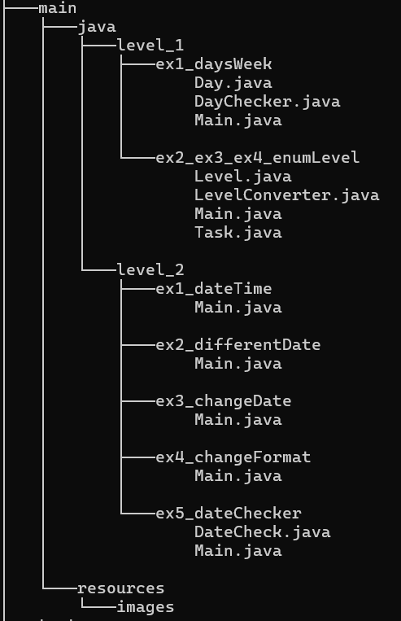

# Enum, Data, Record

Este proyecto está centrado en tres temas fundamentales de Java: enums, fechas y horas, y records.

## Tecnologías

* Java 21
* IntelliJ IDEA
* GitHub

## Estructura del proyecto

### Nivel 1 - Enums

Ejercicios centrados en la creación y uso de enums, sus valores y la incorporación de lógica.

#### Ejercicio 1 - DaysWeek

Crea un enum `Day` con los días de la semana y e imprime si el día indicado es laborable o es fin de semana.

(Los ejercicios 2, 3 y 4 comparten el mismo package)
#### Ejercicio 2 

Crea un enum `Level` con los valores `LOW`, `MEDIUM` y `HIGH`. La clase `Task` utiliza este enum para modificar su comportamiento según el nivel.

#### Ejercicio 3 

Añade métodos y atributos al enum `Level`, asignando un color diferente a cada nivel.

#### Ejercicio 4 

Convierte un `String` a un valor del enum utilizando `valueOf()` y gestiona los valores no válidos.

### Nivel 2 - Fechas y horas

Ejercicios centrados en el uso de la API `java.time` para trabajar con fechas y horas.

#### Ejercicio 1 - DateTime

Utiliza `LocalDate`, `LocalTime` y `LocalDateTime` para obtener y mostrar la fecha y hora actuales.

#### Ejercicio 2 - DifferentDate

Calcula la diferencia entre dos fechas utilizando `Period`.

#### Ejercicio 3 - ChangeDate

Añade días y resta meses a la fecha actual.

#### Ejercicio 4 - ChangeFormat

Utiliza `DateTimeFormatter` para mostrar fechas con diferentes formatos.

#### Ejercicio 5 - DateChecker

Comprueba si una fecha recibida como parámetro es anterior a la fecha actual.

### Nivel 3 - Records

Sé que algunas clases podrían estar más separadas. Por ejemplo, hacer una clase solo para imprimir por consola y dejar la lógica en otra clase.

También podría hacer mis propias excepciones para controlar mejor algunos errores, y hacer tests...

Lo tendré en cuenta para futuros proyectos, intentando hacer las clases más específicas y modularizar mejor el código

En este ejercicio practico el uso de `records` en Java y sus principales características.

## Ejercicios
(Los ejercicios 1, 2, 3 y 4 comparten el mismo archivo)

#### 1. CreateARecord

Crea un `record` llamado `Person` con los parametros `name` y `age`, y muestro cómo se instancia.

#### 2. CustomisedMethods

Añade diferentes métodos dentro del `record` para trabajar con sus datos:

* `fullName()` para crear el nombre completo.
* `legalAge()` para comprobar si la persona es mayor de edad.
* `lengthName()` para comprobar la longitud del nombre.

### 3. ValidationInConstructor 

Validación en el constructor para evitar que se pueda crear una persona con una edad negativa.

### 4. FilterWithLambdasAndStreams

Crea una lista de objetos `Person` y utiliza lambdas y streams para filtrar las personas que son mayores de edad.

### 5. Record class and traditional class (comparison)

En los `record` podemos definir directamente los parámetros en su declaración. A partir de estos parámetros, se crean automáticamente algunos métodos relacionados con ellos. En el código no los vemos, pero disponemos de ellos.

Los parametros de los `record` son inmutables. Una vez creado el objeto, no podemos modificar sus valores.

En las clases tradicionales, los atributos se tienen que definir desde el principio, seguido de un constructor. En los `record`, el constructor se hace automáticamente y no es visible.

Los `record` ya tienen los métodos `toString()`, `equals()`, `hashCode()` y los métodos para acceder a sus parametros. En las clases tradicionales tenemos que hacer estos métodos.

En las clases tradicionales podemos modificar un dato utilizando los metodos `setters` o poniendo el atributo como público. En los `record` no podemos modificarlos una vez creado el objeto.

Para poder usar las clases tradicionales y los `record`, se instancian de la misma manera, y en el momento de llamar a los métodos también se hace de la misma manera, desde el objeto que se creó.
